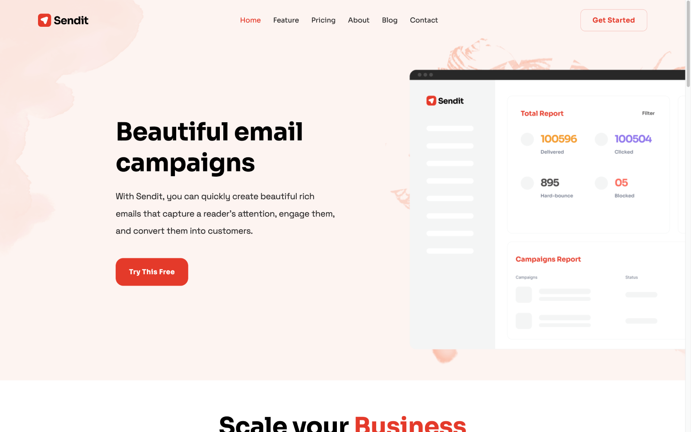

# Sendit

Sendit is a polished, marketing website template for Hugo. Browse through a [live demo](https://jovial-pipe.cloudvent.net/). 

## Features

* Pre-built pages
* Pre-styled components
* Blog with pagination and category pages
* Configurable navigation and footer
* Multiple hero options 
* Optimised for editing in [CloudCannon](https://cloudcannon.com/)

## Setup

Get a workflow going to see your site's output (with [CloudCannon](https://app.cloudcannon.com/) or Hugo locally).

## Develop

Sendit is built with [Hugo](https://gohugo.io/) `0.145.0` — the version pinned
in `.cloudcannon/initial-site-settings.json`. Hugo `0.128.0` is the floor: the
stylesheet is compiled with `css.Sass`, which replaced the `resources.ToCSS`
this template used to call.

### Prerequisites
* Hugo [install](https://gohugo.io/getting-started/installing/). `brew install hugo`
* Go [install](https://go.dev/learn/). `brew install go`

### Quickstart
1. In the terminal at the root dir, run: `npm run start`
* By default the site will be at : [http://localhost:1313/](http://localhost:1313/)

### Components

Components live in `layouts/partials/<group>/<name>.html` and are rendered by
the page builder in `layouts/_default/{list,single}.html`. Each one has a
matching entry under `_structures.content_blocks` in `cloudcannon.config.yaml`,
keyed by `_name` — so a block with `_name: home/hero` renders
`layouts/partials/home/hero.html`.

Components are made editable in CloudCannon's Visual Editor with
[editable regions](https://github.com/CloudCannon/editable-regions), wired up by
the `github.com/CloudCannon/editable-regions` Hugo module.

## Editing

Sendit is set up for adding, updating and removing pages, page builder
components, blog posts, navigation and footer details in
[CloudCannon](https://app.cloudcannon.com/).

Pages and components are edited on the page itself in the Visual Editor. Blog
posts open in either the Content Editor or the Visual Editor.

### Site-wide details

Reused around the site so there is one place to edit each of them. All four are
in the *Data* section:

* **Nav** — logo, menu items and their dropdowns, and the header button.
* **Footer** — logo, copyright line, social links, and the link columns.
* **Meta** — site title, description, favicons and the social share defaults
  used by every page that does not override them.
* **Blog tags** — the list of categories a post can be assigned.
