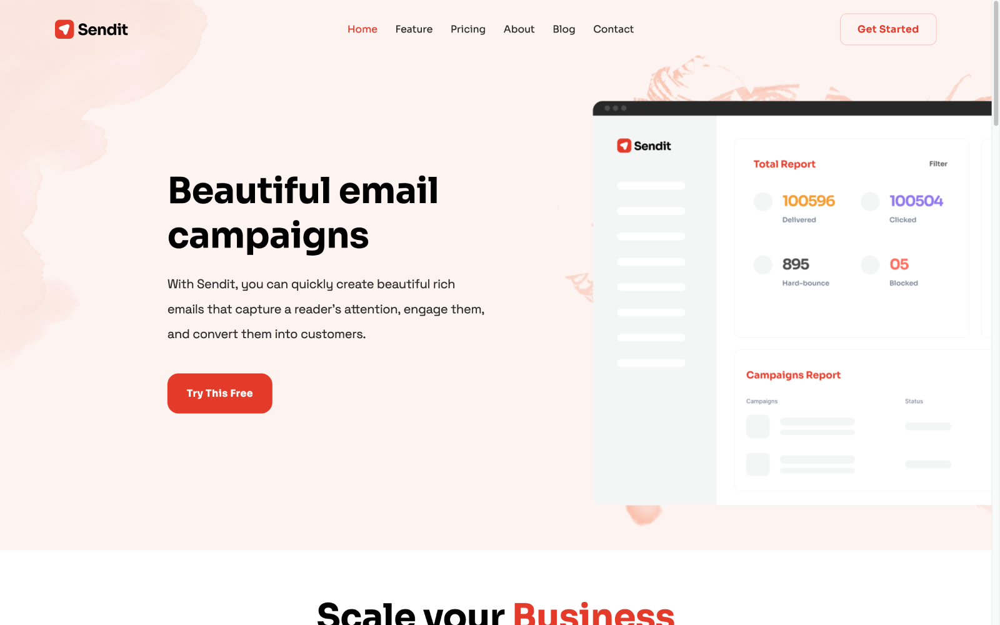

# Sendit

Sendit is a polished, marketing website template for Hugo. Browse through a [live demo](https://jovial-pipe.cloudvent.net/). 




[](https://app.cloudcannon.com/register#sites/connect/github/CloudCannon/sendit-hugo-template)

## Features

* Pre-built pages
* Pre-styled components
* Blog with pagination and category pages
* Configurable navigation and footer
* Multiple hero options 
* Optimised for editing in [CloudCannon](https://cloudcannon.com/)

## Setup

Get a workflow going to see your site's output (with [CloudCannon](https://app.cloudcannon.com/) or Hugo locally).

## Develop

Sendit is built with [Hugo](https://gohugo.io/) `0.166.0` (extended) — the
version pinned in `.cloudcannon/initial-site-settings.json`. Use the same
version locally; the template relies on recent additions such as `hugo.Data`
and `css.Sass`, so older releases won't build it.

### Prerequisites
* Hugo [install](https://gohugo.io/getting-started/installing/). `brew install hugo`
* Go [install](https://go.dev/learn/). `brew install go`

### Quickstart
1. In the terminal at the root dir, run: `npm run start`
* By default the site will be at : [http://localhost:1313/](http://localhost:1313/)

### Components

Components live in `layouts/partials/<group>/<name>.html` and are rendered by
the page builder in `layouts/_default/{list,single}.html`. Each one has a
matching entry under `_structures.content_blocks` in `cloudcannon.config.yaml`,
keyed by `_name` — so a block with `_name: home/hero` renders
`layouts/partials/home/hero.html`.

Components are made editable in CloudCannon's Visual Editor with
[editable regions](https://github.com/CloudCannon/editable-regions), wired up by
the `github.com/CloudCannon/editable-regions` Hugo module.

### Editing Locally with CloudCannon

Run CloudCannon against your local files with the [CloudCannon CLI](https://cloudcannon.com/documentation/developer-reference/cli/)
dev server. This is the fastest way to iterate on `cloudcannon.config.yaml`, inputs, and structures —
you see the editing experience without committing and pushing first.

1. Install the CLI and log in (requires Node.js 24+):

   ```bash
   npm install --global @cloudcannon/cli
   cloudcannon login
   ```

2. Build the site, so the dev server has output to serve:

   ```bash
   npm run build
   ```

3. Start CloudCannon locally, pointing it at the build output:

   ```bash
   cloudcannon dev public
   ```

The dev server runs on port `10101` by default and opens CloudCannon in your browser, pointed at the
files in this repo. Content edits sync to disk as you make them; re-run the build after changing
components or templates to refresh the preview.

Before you commit configuration changes, validate them:

```bash
cloudcannon validate
```

The dev server is a development tool only — editors never access it. See
[Build your editing experience locally](https://cloudcannon.com/blog/build-your-editing-experience-locally-with-the-cloudcannon-dev-server/)
for the full workflow.

## Editing

Sendit is set up for adding, updating and removing pages, page builder
components, blog posts, navigation and footer details in
[CloudCannon](https://app.cloudcannon.com/).

Pages and components are edited on the page itself in the Visual Editor. Blog
posts open in either the Content Editor or the Visual Editor.

### Site-wide details

Reused around the site so there is one place to edit each of them. All five
are in the *Data* section:

* **Nav** — logo, menu items and their dropdowns, and the header button.
* **Footer** — logo, copyright line, social links, and the link columns.
* **Meta** — site title, site URL, description, favicons and the social share
  defaults used by every page that does not override them. The site URL is the
  base for canonical links and social share URLs, so update it when the site
  moves to its own domain.
* **Blog tags** — the list of categories a post can be assigned.
* **Theme** — the primary, secondary and link colours. These are also edited
  from the palette button that appears in the Visual Editor.
